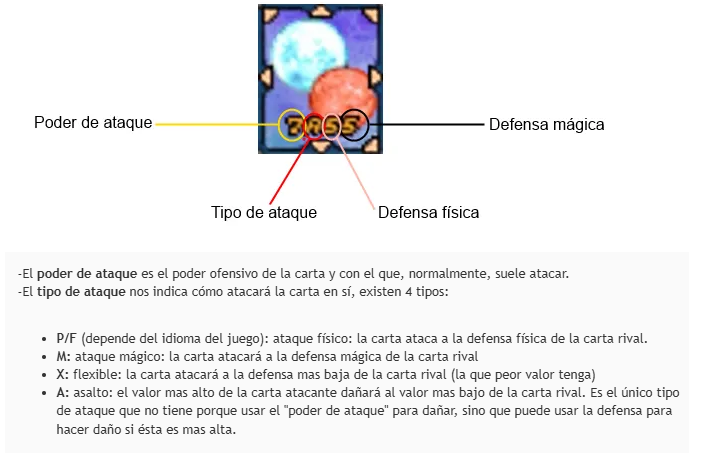
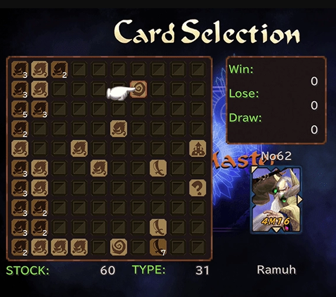
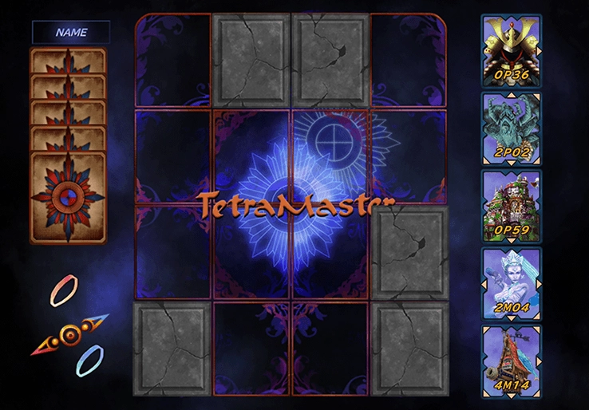

# Python_TetraMasterVicLogicEngine
Es un Motor de la lógica del Videojuego TetraMaster de Final Fantasy IX
## Las cartas
Una carta de tetramaster tiene las siguientes características

Los puntos que le corresponden son:

| Valor | Mínimo | Máximo |
|-------|--------|--------|
| 0     | 000    | 015    |
| 1     | 016    | 031    |
| 2     | 032    | 047    |
| 3     | 048    | 063    |
| 4     | 064    | 079    |
| 5     | 080    | 095    |
| 6     | 096    | 111    |
| 7     | 112    | 127    |
| 8     | 128    | 143    |
| 9     | 144    | 159    |
| A     | 160    | 175    |
| B     | 176    | 191    |
| C     | 192    | 207    |
| D     | 208    | 223    |
| E     | 224    | 239    |
| F     | 240    | 255    |

La fórmula para generar la tabla se basa en multiplicar por 16 el valor, y así los rangos mínimo y máximo se dan por:

$$
\begin{array}{lcl}
min & = & 16 \cdot v  \\
max & = & 16 \cdot (v+1)  -1    
\end{array}
$$

## Pantalla Selector de cartas
Al inicio el jugador debe elegir cinco cartas de  su mazo, en la siguiente pantalla

## Mesa de batalla
El aspecto de la mesa de juego o de batalla es:

